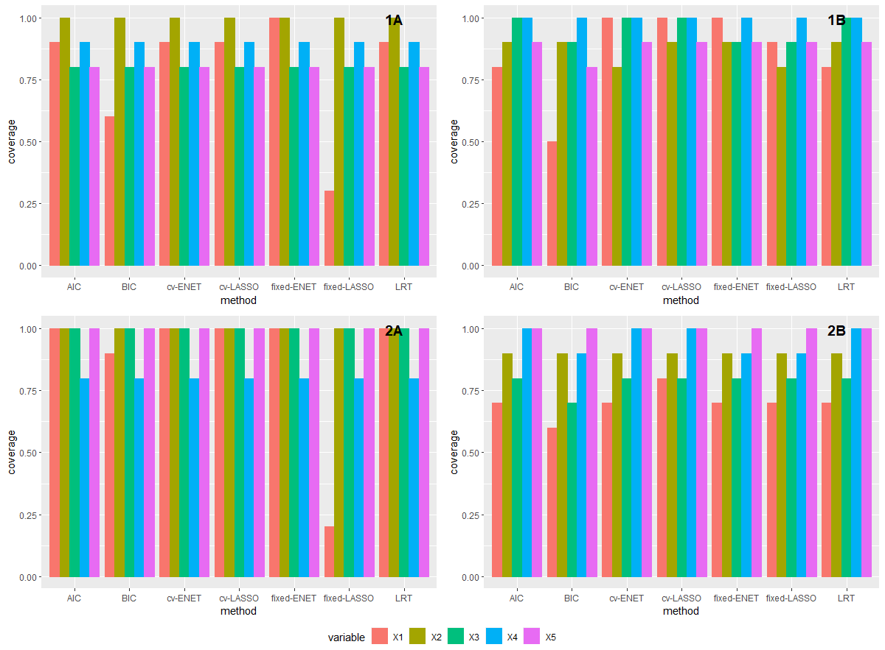

```{r setup, include=FALSE}
knitr::opts_chunk$set(warning = FALSE)
```
\doublespacing
\newpage

\section{Introduction}

The purpose of this analysis is to investigate several common variable selection techniques used primarily in linear regression. We are most interested in comparing the reliability of these variable selection methods when it comes to several measures of precision and accuracy, which will be detailed below. Most importantly, we want to know if variable selection techniques can pick out variables that are already known to be significant. And how that relates to the effect size of the variable coefficients. Additionally, we are also interested in how well variable selection techniques ignore variables that are not statistically significant.

To investigate variable selection techniques, the analysis team will perform a simulation of data. There are two primary simulations for this analysis. The first is to simulate data using a sample size of 250 and the second is to simulated data using a sample size of 500. For each sample size, we will simulate both correlated and uncorrelated data. The details of those simulations are outlined below.

It is hypothesized that all variable selection methods will select variables with larger effect sizes more accurately than those with small effect sizes. It is also apparent that more conservative selection methods will wrongly select insignificant variables less frequently that the more anti-conservative selection techniques. Lastly, it is hypothesized that methods that use penalized regression techniques will select insignificant variables at a much higher rate than other selection methods.

\section{Materials and Methods}

\subsection{Variable Selection}

This analysis will explore seven variable selection techniques, from two general selection fields, backwards selection, and penalized regression.

### Backwards Selection

Backwards selection is the older more traditional variable selection method. It is done by fitting a model with all available variables, and iteratively removing insignificant predictors one variable at a time based on certain criteria. The three criteria we are using for this analysis, are Likelihood Ratio Test (LRT) p-values, Akaike Information Criterion (AIC), and Bayesian Information Criterion (BIC). The formulas for each are provided below.

\singlespacing
\begin{equation}\label{eq}
  \lambda_{LR} = -2\big[l(\theta_0) - l(\hat{\theta})\big]
\end{equation}

\begin{equation}\label{eq}
  AIC = -2k - 2l(\hat{\theta})
\end{equation}

\begin{equation}\label{eq}
  BIC = -kln(n) - 2l(\hat{\theta})
\end{equation}

$$l(\theta) : \text{log-likelihood}$$
$$n : \text{sample size}$$
$$k : \text{number of parameters}$$
\doublespacing

### Penalized Regression

We are also interested in two variations of two penalized regression model selection techniques. The two methods are LASSO, and Elastic Net. We will use both a fixed value LASSO and Elastic Net, and 10-fold cross-validated LASSO and Elastic Net. This means that tuning parameters are either prespecified (fixed), or cross-validated (CV). These methods find the best fit model by optimized the log-likelihood plus a penalty term, which is some non-negative function of the all parameters in the model. The penalty terms are as follows.

\singlespacing
LASSO:
\begin{equation}\label{eq}
  \lambda||\theta||_1
\end{equation}

Elastic Net:
\begin{equation}\label{eq}
  \lambda(\alpha||\theta|_1+(1-\alpha)||\theta||_2)
\end{equation}

$$\lambda,\alpha : \text{tuning parameters}$$
\doublespacing

It should be noted that to fit final models after using penalized regression for variable selection, standard linear regression modeling was used. This was only to obtain estimates for model comparison (see limitations).

\subsection{Simulation}

### Model
\singlespacing
The standard linear regression model is as follows:

\begin{equation}\label{eq}
  Y_i = \sum_{j=1}^p \beta_j X_{ji} + \epsilon_{i}
\end{equation}

$$X_i \sim \mathcal{N}(\textbf{0}, \boldsymbol{\Sigma})$$
$$\epsilon_i \sim \mathcal{N}(0, \sigma^2)$$
$$i = 1, ..., n$$
$$j = 1, ..., p$$
The coefficients from which the data were simulated for each scenario are as follows:

$$\boldsymbol{\beta} = \bigg[\frac{1}{6}, \frac{2}{6}, \frac{3}{6}, \frac{4}{6}, \frac{5}{6}, 0, 0, 0, 0, 0, 0, 0, 0, 0, 0, 0, 0, 0, 0, 0\bigg]$$
\doublespacing

The each of the four scenarios mentioned previously use the information provided above. Additionally, scenarios \textit{1B} and \textit{2B} induce a correlation of $\rho = 0.4$ for the predictor variables. 

\subsection{Evaluation}

For each aim, 1000 data sets were simulated and then analyzed for eight evaluation parameters of interest. The evaluation parameters are provided below.
\singlespacing
\begin{equation}\label{eq}
  \text{True Positive Rate } (TPR) = \frac{\text{number of times } x_i \text{ is selected}}{1000}, \text{for each } \beta_i \neq 0
\end{equation}

\begin{equation}\label{eq}
  \text{False Positive Rate } (FPR) = \frac{\text{number of times } x_i \text{ is selected}}{15*1000},\; \forall \beta_i = 0
\end{equation}

\begin{equation}\label{eq}
  \text{False Discovery Rate } (FDR) = \frac{\text{number of } x_i \text{ w/} x_i = 0 \text{ that are selected}}{\text{number of } x_i \text{that are selected}}, \text{across all 1000 simulations}
\end{equation}

\begin{equation}\label{eq}
  \text{Average Bias } (\text{bias}_0) = \frac{1}{n_\beta}\sum_{\forall \beta} \beta_{observed} - \beta_{expected},\; \forall \beta_i = 0
\end{equation}

\begin{equation}\label{eq}
  \text{Bias } = \beta_{observed} - \beta_{expected}, \text{for each} \beta_i \neq 0
\end{equation}

\begin{equation}\label{eq}
  \text{Coverage } = \frac{\text{number of times the 95\% CI for } \hat{\beta}_i \text{ contains } x_i}{\text{number of times } x_i \text{ is selected}}, \text{for each } \beta_i \neq 0
\end{equation}

\begin{equation}\label{eq}
  \text{Type I error rate } = \frac{\text{number of times } x_i \text{ selected and p-value } < 0.05}{\text{number of times } x_i \text{ is selected}}, \forall \beta_i = 0
\end{equation}

\begin{equation}\label{eq}
  \text{Type II error rate } = \frac{\text{number of times } x_i \text{ is selected and p } \geq 0.05}{\text{number of times } x_i \text{ is selected}}, \text{ for each} \beta_i \neq 0
\end{equation}

\doublespacing
We expect type I error rates and type II error rates to be inflated and dflated respectively, due to them being conditioned on the number of times a variable is selected. All statistics presented above are contained between 0 and 1. A favorable value for TPR and coverage rate is 1, and a favorable value for FPR, FDR, bias, type I error, average bias, and type II error is 0.


\section{Results}

\subsection{Bias}

Figure 1 shows the bias for each method, with each of variables 1 through 5 as different colors, stratified by aim. Bias was fairly small, and distributed randomly for scenario 1A. Bias was consistently higher for all methods in aim's 1A and 2a than it was in aim's 1B and 2B. Bias was reliably high for all aims after aim 1A using fixed LASSO penalized regression. Bias was reliably low for all aims after aim 1A using the LRT p-value variable selection method. 

\subsection{95% Confidence Interval Coverage}

The coverage of the 95% confidence intervals is shown in figure 2. As can be seen visually, there was fairly consistent coverage across all aims and all selection techniques. All model selection techniques had more trouble on average capturing variable $X1$. For the independent data simulations (1A & 2A), fixed LASSO penealized regression was particularly bad at capturing variable $X1$.

\subsection{True Positive Rate}

Presented in figure 3 is the true positive rate for each variable and each method, stratified by aim. Figure 3 shows very clearly that that variable $X1$ was selected correctly at a much lower rate than variables $X2-X5$. And the true positive rate was particularly low for fixed LASSO penalized regression and small sample sizes (aims 1A & 2A).

\subsection{Average False Discovery Rate}

Presented in figure 4 is the average FDR across variables $X6-X20$. There are two things of note here, the first is that BIC backward selection had the lowest FDR consistently across all aims. The second is that the cross-validated penalized regression methods had particularly high FDR across all aims.

\subsection{False Positive Rate}

Similar to the FDR, the average FPR across variables $X6-X20$, shown in figure 5 was consistently lowest across all aims using the BIC backward selection method. And highest across all aims using the cross-validate penalized regression methods.

\subsection{Type I error Rate}

Shown in figure 6 is the average type I error across variables $X6-X20$. The type I error is consistently high aross all aims using the BIC backward selection method. The type I error rate was also notably high in the fixed penalized regression selection methods for independent data (aims 1A and 2A).

\section{Conclusion}

\subsection{Discussion}

This simulation demonstrated some interesting findings. First and foremost, in response to the hypotheses, variable selection on data simulated for larger data sets did seem to be slightly better (aims 2A & 2B) than those of smaller sample size (aims 1A & 1B). It was also confirmed that of the non-zero coefficients ($\beta_1 - \beta_5$) the smallest effects size ($\beta_1$) was selected less frequently by all selection methods than the other four variables. Additionally, the BIC is considered to be conservative (has a significant penalty, particularly for large sample sizes), and this selection did in fact wrongly select insignificant variables at a much lower rate than any other method. Lastly, the cross-validated penalized regression models did seem to be selecting insignificant variables at a much higher rate than any other model on average across all aims. This is likely due to the design of these methods, which are designed to optimized prediction, so they favor leaving in variables that explain small amounts of variability in the outcome.

\subsection{Limitations}

One significant limitation for this analysis was the way that regression models were built after selection using all of the penalized regression methods. After all four of these models selected significant variables, and then linear regression models were reran to evaluate coefficient values, 95% confidence intervals, and p-values. Additionally, it would be of interest to evaluate these methods on much smaller ($< 50$) and much larger ($> 1000$) data in addition to the sample sized used in this analysis, this may teach us more about varaible selection in extreme circumstances.

\section{Reproducibility}

Each of the analyses for all aims were performed in `R 4.1.2`. The simulated data was generated using `hdrm::genData()`.

Code for this analysis is available from `https://github.com/BIOS6624-UCD/bios6624-JoeFroelicher/project4`, under the branch `project4`. Special note `@ehccooper` for assistance on both report writing and mathematical formulation.


\section{Figures}

{#id .class width=500 height=500px}
  
  
{#id .class width=500 height=500px}
  
  
{#id .class width=500 height=500px}
  
  
{#id .class width=500 height=500px}
  
  
{#id .class width=500 height=500px}
  
  
{#id .class width=500 height=500px}
  
  
\newpage
\newpage
\newpage
* 

\newpage

\section{Supplementary Figures}

{#id .class width=500 height=1000px}
  
  
{#id .class width=500 height=1000px}
  
  
{#id .class width=500 height=1000px}
  
  
{#id .class width=500 height=1000px}
  
  
{#id .class width=500 height=500px}
  
  
{#id .class width=500 height=500px}
  
  